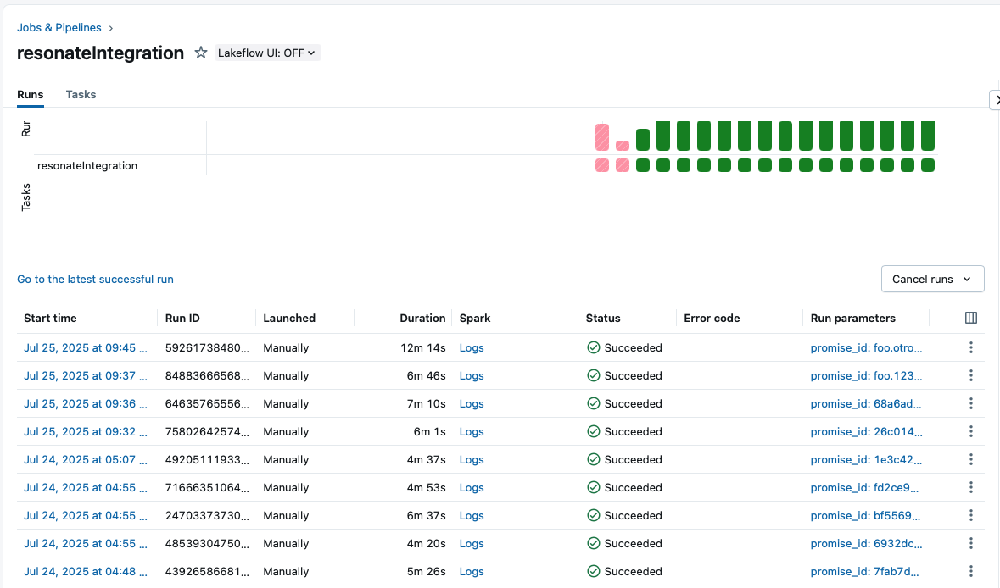

# Integrating Databricks with your backend service with Resonate | Example application

Databricks is a leading cloud-native data analytics platform that fully manages and optimizes Apache Spark infrastructure for you. It empowers data teams to iterate rapidly—developing prototypes in interactive notebooks and seamlessly scaling them into robust, production-grade pipelines and machine-learning services—all without the hassle of cluster provisioning, configuration, or maintenance.

It’s an amazing tool.

Once you have a notebook you’re happy with, you can programmatically run it on a schedule or on-demand—effectively integrating it into your business operations.

But here’s the challenge: coordination with the rest of your system.
How do you trigger a Databricks job and wait for its completion before continuing your business logic?

Most teams end up splitting their logic into two parts:
- The first handler triggers the Databricks job.
- A second handler listens for the completion event and resumes execution.

This pattern might works, but it comes at a cost: **readability** and **maintainability**.
As you add more steps and external services, your codebase devolves into callback hell—where even the simplest use case spans multiple files, event listeners, and background jobs. Understanding the full execution path becomes a painful and error-prone process.

This is where Resonate shines.

Resonate lets you write your backend workflows as simple, sequential scripts—just like you're used to—while ensuring that those scripts are:

- Reliable
- Coordinated across services
- Deployable in distributed environments

The rest of this guide shows you a real example of how to integrate Databricks using Resonate. My hope is that you’ll see how simple it is—and that the same pattern can be reused for any third-party computation service.

## A backend service

```python
app = FastAPI()
resonate = Resonate().remote(group="default")
resonate.start()


# handlers
@app.get("/run")
async def get(id: str, url: str):
    h = databricks_integration.begin_run(id, url)
    if h.done():
        return "I'm done"
    return "working on it"


@app.post("/resolve")
async def resolve(id: str, value: str):
    resonate.promises.resolve(id, ikey=id, data=json.dumps(value))
```

A FastAPI with two endpoints. `/run` which asyncronously runs the use case `databricks_integration`. (Note that the execution is never awaited, it just lets the user know if it's still in progress or already completed.) And `/resolve`, this is the only endpoint any integrated service will use, it's job is to resolve promises (the coordination mechanism Resonate uses), to unblock workflow executions.

## A databricks notebook
```python

# logic
df = spark.range(10)
display(df)

# let resonate know you are finished
url = dbutils.widgets.get("url")
promise_id = dbutils.widgets.get("promise_id")
import requests
response = requests.post(f"{url}/resolve", params={"id":promise_id , "value":"hello world"})
response.raise_for_status()  # Raise an error for bad status codes
```

This would be the notebook that the business runs on-demand from the backend service, it doesn't have any logic really but you can imagine any complex data pipeline you want there. The key aspect is that once the data processing finishes, you will notify the backend service to resolve the promise. Additionally, you can optinally introduce any data in the promise resolution to not only let the execution know it can resume, but also with which value it must continue with.

### A business workflow
```python
@resonate.register
def databricks_integration(ctx: Context, url: str) -> Generator[Yieldable, Any, None]:
    p = yield ctx.promise()
    yield ctx.run(run_workflow, job=<id>, promise_id=p.id, url=url)
    v = yield p
    print(f"databricks execution has finished with value {v}")
    # continue any business logic
    return


# functions
def run_workflow(ctx: Context, job: int, promise_id: str, url: str) -> None:
    client = ApiClient(
        host="https://<url>.cloud.databricks.com",
        token="<token>",
    )
    jobs = JobsApi(client)
    jobs.run_now(
        job_id=job,
        notebook_params={"promise_id": promise_id, "url": url},
        jar_params=None,
        python_params=None,
        spark_submit_params=None,
    )
```

This is how you define Resonate workflows. The idea here is to first create a promise `yield ctx.promise()`, that will be in a pending state until completed at the end of the databricks notebook execution. Then we will trigger the notebook with the function `run_workflow` passing the `promise_id`.



The job might take anywhere between 3 minutes to 10 minutes. Doesn't matter, the only think we care about is that Resonate will resume the execution of the workflow once the notebook finished. This is true even if you kill the backend service, once one node is available Resonate will resume the invocation from when it was previously.

Finally, we `yield p`. Awaiting the execution until the promise is resolved. This can be minutes, as most likely will be, hours or even days (If let's say, the team had a bug on the notebook they need to fix first)

### How to run

```bash
resonate serve --aio-store-sqlite-path :memory:
```

```bash
uvicorn app:app --reload
```

```bash
python trigger.py --id foo --url https://823166f9008f.ngrok-free.app
```


On the job finishes you'll see this line get printed

```python
print(f"databricks execution has finished with value {v}")
```

```bash
python trigger.py --id foo --url https://823166f9008f.ngrok-free.app
```
