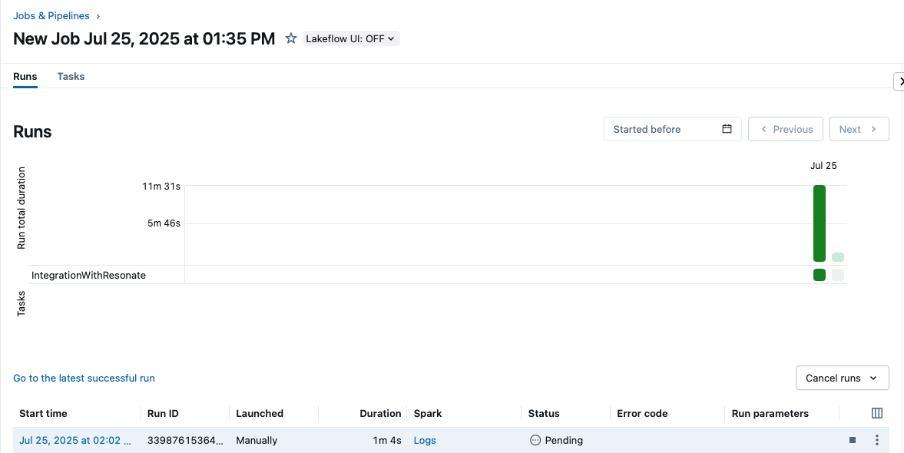
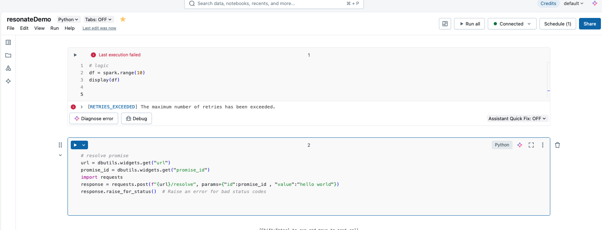

# Integrating Databricks with your backend service with Resonate | Example application

Databricks is a leading cloud-native data analytics platform that fully manages and optimizes Apache Spark infrastructure for you. It empowers data teams to iterate rapidly—developing prototypes in interactive notebooks and seamlessly scaling them into robust, production-grade pipelines and machine-learning services—all without the hassle of cluster provisioning, configuration, or maintenance.

Let's start by writing the most Databricks notebook.


As you can see, we don't really care about the complexity of the data pipeline logic here. You can imagine any complex operation. The important thing is that we have a notebook we want to programatically invoke.

This is were Databricks Jobs come into play. You can use them to orchestrate notebooks execution via API.


Let's try it.

```python
from databricks_cli.sdk.api_client import ApiClient
from databricks_cli.jobs.api import JobsApi

DATABRICKS_HOST = ...
DATABRICKS_TOKEN = ... # see how to get a token: https://docs.databricks.com/aws/en/dev-tools/auth/pat
JOB_ID = ...

client = ApiClient(
    host=DATABRICKS_HOST,
    token=DATABRICKS_TOKEN,
)
jobs = JobsApi(client)
jobs.run_now(
    job_id=JOB_ID,
    notebook_params=None,
    jar_params=None,
    python_params=None,
    spark_submit_params=None,
)
```

You should see the invocation happening



Few minutes later, it will succeed.

Ok, now the question is how can we coordinate the invocation with the rest of our system. Let's say you want to define some logic in you backend where you'll trigger the Databricks job and once completed you'll send an email to the user notifying them that their data processing is ready.

Ideally you want something like this.

```python
async def datapipeline():
    completed = await databricks_job_to_finish()
    assert completed
    await send_email_to_user()
```

But this is not possible, a Databricks job can take up to hours (or more!) and it's possible that it fails and you need to fix a bug. The Jobs API returns inmediatelly after triggering the job, after the invocation happens you cannot be sure how much time it will take. So maybe an event-driven architecture?

```python
async def datapipeline_part_1():
    await trigger_databricks_job()

async def datapipeline_part_2():
    await send_email_to_user()

```

The idea here is to split the business logic in different handlers. The first handler will execute up to the invocation of the databricks job, and then we need to make the databricks job inform our backend it has finished. This could work, but you must compromise readability and maintainability. Your business logic, which is a cohesive series of steps is now splitted across handlers, as this pattern grows you'll end up with a callback hell that is very difficult to debug and understand (particularly for members of your team).

This is where, we believe, Resonate adds a lot of value. You can write sequental looking code, zero compromises on readibility and maintainability. You can read you whole business logic from top to bottom in a single defined function, the exact function capable of realiably running on a distributed enviroment, coordinate across services in an event-driven way and with guarantees such as recovery in the precense of failure.

```python
def datapipeline(ctx):
    p = yield ctx.promise()
    yield ctx.run(trigger_databricks_job, p.id)
    yield p
    yield ctx.run(send_email_to_user)
```

This is how it would like like, literally just that. Fully sequential looking code. Most likely, you are trying to understand what does `ctx.promise()` do. At Resonate, we use `Promises` to represent the future completion of an execution usually this is never exposed to the user, but you can use this concept to promisify anything... in this case, the completion of a Databricks notebook.

What this code will do is 1) create a promise 2) trigger the databricks job 3) wait until the promise representing the notebook completion is finished and then 4) notify the user that their data pipeline is ready

How do we indicate the promise completion when the notebook finishes? Do an API request to complete the promise.



Just with that, when the promise is completed, Resonate will coordinate the resumption of you execution.

So let's build the whole thing.

## FastAPI backend to trigger the data pipeline and expose and endpoint to resolve promises

```python
app = FastAPI()
resonate = Resonate().remote()
resonate.start()


# handlers
@app.get("/run")
async def get(id: str, url: str):
    h = data_pipeline.begin_run(id, url)
    if h.done():
        return "I am done"
    return "working on it"


@app.post("/resolve")
async def resolve(id: str, value: str):
    resonate.promises.resolve(id, ikey=id, data=json.dumps(value))
```

## Data Pipeline definition
```python
@resonate.register
def data_pipeline(ctx: Context, url: str) -> Generator[Yieldable, Any, None]:
    p = yield ctx.promise()
    yield ctx.run(run_job, promise_id=p.id, job=os.environ["JOB_ID"], url=url)
    v = yield p
    # yield ctx.run(send_email)
    print(f"databricks execution has finished with value {v}")
    return


def run_job(ctx: Context, promise_id: str, job: int, url: str) -> None:
    client = ApiClient(
        host=os.environ["DATABRICKS_HOST"],
        token=os.environ["DATABRICKS_TOKEN"],
    )
    jobs = JobsApi(client)
    jobs.run_now(
        job_id=job,
        notebook_params={"promise_id": promise_id, "url": url},
        jar_params=None,
        python_params=None,
        spark_submit_params=None,
    )

```

## A Databricks Job that receives the promise_id and url as param


## A way to expose the local server, publicly

```bash
ngrok http 8000
```

## A way to trigger the whole thing
```bash
python trigger.py --id foo --url <ngrok url>
```

Once the `data_pipeline` is done

```bash
python trigger.py --id foo --url <ngrok url>
# Response: "I am done"
```
